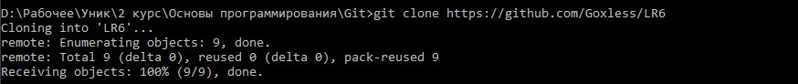
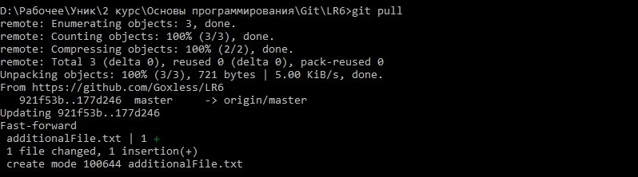
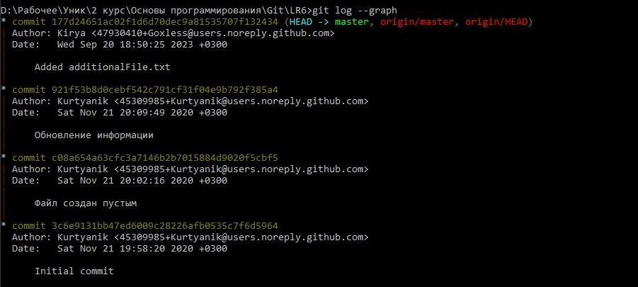
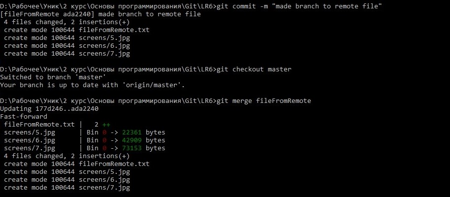
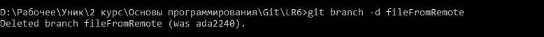
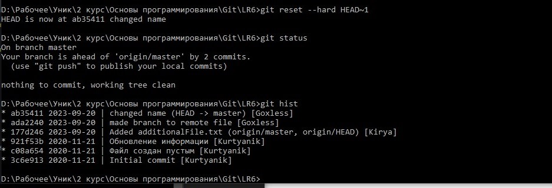
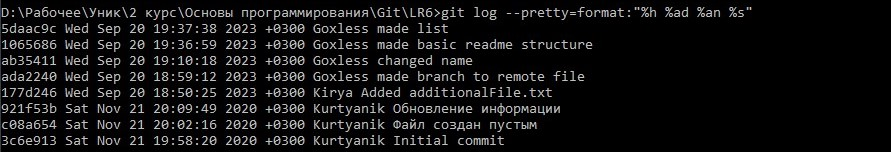
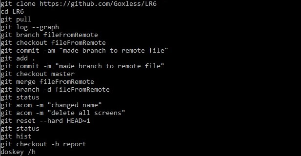

# Лабораторная работа №6

**Цель лабораторной работы**: изучение базовых возможностей системы
управления версиями, опыт работы с Git Api, опыт работы с локальным и
удаленным репозиторием.

## Выполнение работы


5. Клонировать свой личный удалённый репозиторий на компьютер.<br>


6. Добавить файл через интерфейс GitHub. Подтянуть изменения в локальный репозиторий..<br>


7. Получить историю операций для каждой из веток. .<br>


8. Просмотреть последние изменения. .<br>


9. Выполнить слияние в ветку master, разрешив конфликт. .<br>


10. Удалить побочную ветку после успешного слияния..<br>


11. Сделать изменения и зафиксировать их, оставляя комментарии ,несколько раз. .<br>


12. Сделать откат коммита. .<br>


13. Создать ветку для отчёта..<br>


14. Начать оформлять отчёт.<br>

15. Получить историю операций в форматированном виде.<br>

16. Отправить локальные изменения в сетевое хранилище GitHub

```bash
    git push -u origin 
```
***Лог команд***:
>